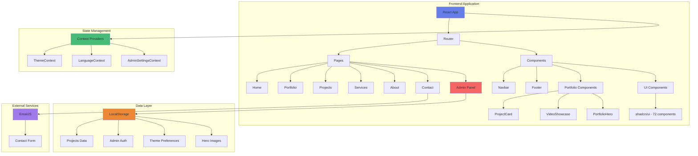

# 🎨 Kaleab M - Portfolio Website

A modern, professional portfolio website built with React, TypeScript, and Tailwind CSS. Features a powerful admin panel for content management, video support, dark mode, and responsive design.

   

## 🌟 Features

### Portfolio Showcase
- ✅ Modern, responsive design
- ✅ Interactive project cards with image/video toggle
- ✅ YouTube and local video support
- ✅ Category filtering and search
- ✅ Dark/Light mode
- ✅ Multi-language support (65+ languages)

### Admin Panel
- ✅ Password protected (default: 2580)
- ✅ Complete CRUD operations for projects
- ✅ Media management (images and videos)
- ✅ Real-time updates
- ✅ Data persistence with LocalStorage

### Video Features
- ✅ YouTube URL integration
- ✅ Local video uploads
- ✅ Toggle between image and video views
- ✅ Full-screen video player

## 🏗️ Architecture



## 📁 Project Structure

```
portfolio/
├── src/
│   ├── components/          # React components
│   │   ├── portfolio/      # Portfolio-specific components (7)
│   │   ├── ui/             # shadcn/ui components (72)
│   │   ├── Navbar.tsx
│   │   ├── Footer.tsx
│   │   └── HeroSection.tsx
│   ├── pages/              # Page components (9)
│   │   ├── Home.tsx
│   │   ├── Portfolio.tsx
│   │   ├── Projects.tsx
│   │   ├── Services.tsx
│   │   ├── About.tsx
│   │   ├── Contact.tsx
│   │   ├── AdminPanel.tsx
│   │   ├── PrivacyPolicy.tsx
│   │   └── TermsOfService.tsx
│   ├── contexts/           # React contexts (3)
│   │   ├── ThemeContext.tsx
│   │   ├── LanguageContext.tsx
│   │   └── AdminSettingsContext.tsx
│   ├── hooks/              # Custom hooks (4)
│   ├── lib/                # Utilities (3)
│   ├── types/              # TypeScript types (3)
│   ├── utils/              # Helper functions (4)
│   ├── App.tsx             # Main app component
│   ├── main.tsx            # Entry point
│   └── index.css           # Global styles
├── public/
│   ├── images/             # Static images
│   ├── locales/            # Translation files (65+ languages)
│   └── favicon files
├── package.json
├── vite.config.ts
├── tailwind.config.ts
└── tsconfig.json
```

## 🚀 Quick Start

### Prerequisites
- Node.js 18+ 
- npm or yarn

### Installation

```bash
# Clone the repository
git clone <your-repo-url>
cd portfolio

# Install dependencies
npm install

# Start development server
npm run dev
```

The app will be available at `http://localhost:8082`

### Build for Production

```bash
# Create production build
npm run build

# Preview production build
npm run preview
```

## 🎯 Available Scripts

| Script | Description |
|--------|-------------|
| `npm run dev` | Start development server on port 8082 |
| `npm run build` | Build for production |
| `npm run preview` | Preview production build |
| `npm run lint` | Run ESLint |
| `npm run lint:fix` | Fix ESLint errors |
| `npm run type-check` | Run TypeScript type checking |

## 🔐 Admin Panel

Access the admin panel at `/admin`

**Default Password:** `2580`

### Admin Features:
- Create, edit, and delete projects
- Upload images and videos
- Manage hero images
- Update profile photo
- Toggle project visibility
- Set featured projects

## 🎨 Tech Stack

### Core
- **React** 18.3.1 - UI framework
- **TypeScript** 5.6.0 - Type safety
- **Vite** 5.4.7 - Build tool
- **React Router** 6.30.1 - Routing

### Styling
- **Tailwind CSS** 3.4.11 - Utility-first CSS
- **Framer Motion** 12.23.12 - Animations
- **shadcn/ui** - Component library (72 components)
- **Lucide React** - Icons
- **React Icons** - Social media icons

### Forms & Validation
- **React Hook Form** 7.53.0
- **Zod** 3.25.76
- **@hookform/resolvers** 5.2.1

### Internationalization
- **i18next** 25.4.1
- **react-i18next** 15.0.0
- **65+ languages** supported

### External Services
- **EmailJS** - Contact form emails

## 🌍 Multi-Language Support

The portfolio supports 65+ languages with automatic browser detection:
- English, Spanish, French, German, Italian
- Arabic, Chinese, Japanese, Korean
- And 56+ more languages

Translations are stored in `/public/locales/`

## 🎨 Customization

### Update Personal Information

Edit the following files:
- `/src/pages/About.tsx` - Bio and skills
- `/src/pages/Services.tsx` - Services offered
- `/src/pages/Contact.tsx` - Contact information

### Add Projects

Use the Admin Panel (`/admin`) to:
1. Login with password `2580`
2. Click "Add New Project"
3. Fill in project details
4. Upload images/videos
5. Save

### Change Theme Colors

Edit `/src/index.css` to customize:
- Primary colors
- Background colors
- Dark mode colors

### Update Admin Password

Edit `/src/pages/AdminPanel.tsx`:
```typescript
const ADMIN_PASSWORD = "your-new-password";
```

## 📦 Deployment

### Netlify (Recommended)

```bash
# Build the project
npm run build

# Deploy dist folder to Netlify
# Or connect your GitHub repo to Netlify for automatic deployments
```

### Vercel

```bash
# Install Vercel CLI
npm i -g vercel

# Deploy
vercel --prod
```

### GitHub Pages

```bash
# Build
npm run build

# Deploy dist folder to gh-pages branch
```

## 🔧 Configuration Files

- `vite.config.ts` - Vite configuration
- `tailwind.config.ts` - Tailwind CSS configuration
- `tsconfig.json` - TypeScript configuration
- `netlify.toml` - Netlify deployment config
- `vercel.json` - Vercel deployment config

## 📝 License

MIT License - feel free to use for your own portfolio!

## 🤝 Contributing

This is a personal portfolio template. Feel free to fork and customize for your own use!

## 📧 Contact

- **Email:** your.email@example.com
- **LinkedIn:** your-linkedin
- **GitHub:** your-github

---

⭐ **Star this repo if you find it helpful!**

Built with ❤️ using React, TypeScript, and Tailwind CSS
